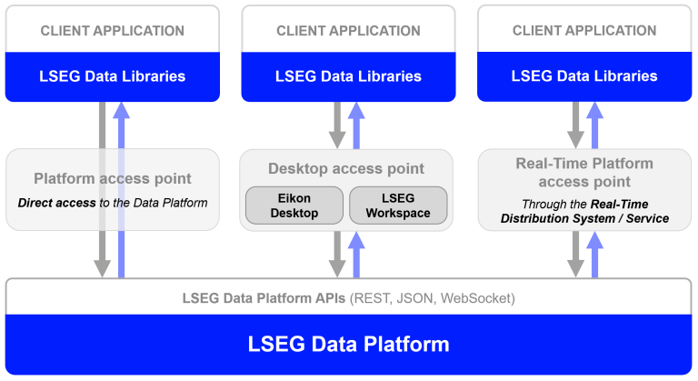
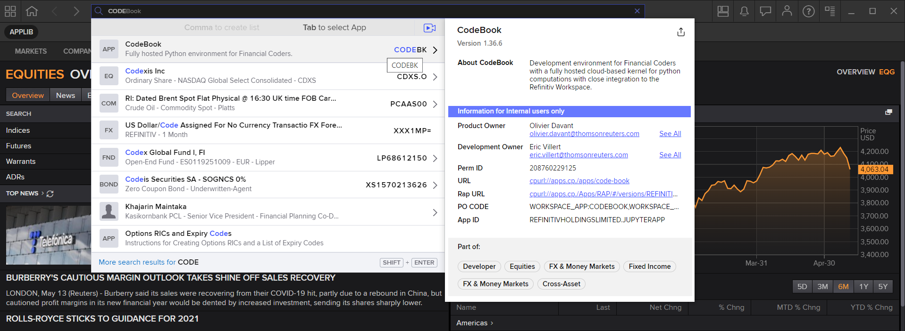

# Plotting Financial Data Chart with Plotly Python 
- Last update: March 2025
- Environment: Windows 
- Compiler: Python
- Prerequisite:  Workspace application with access to Data Library

## <a id="overview"></a>Overview

With the rise of Data Scientists, Financial coders, or Traders (aka Citizen Developers), data visualization is a big part of how to present data, information, and its context to the readers (Financial team, Marketing team, etc.). The good data analysis itself cannot be used with a good graph representation. 

The [Matplotlib Pyplot](https://matplotlib.org/stable/api/_as_gen/matplotlib.pyplot.html) is a de-facto library for making interactive plot and data visualization in the Python and Data Scientists world. However, the [Matplotlib](https://matplotlib.org/) is a huge library that contains several interfaces, capabilities, and 1000+ pages of documents.  

There are a lot of others alternative Plotting libraries such as [Seaborn](https://seaborn.pydata.org/) (which is a high-level interface of Matplotlib), [Spotify](https://www.spotify.com/us/home/)'s [Chartify](https://github.com/spotify/chartify), [Bokeh](https://docs.bokeh.org/en/latest/), [Plotly Python](https://plotly.com/python/), etc.

This example project demonstrates how to use the Plotly Python library to plot various types of graphs. The demo application uses data from LSEG Workspace platform via the [LSEG Data Library for Python](https://developers.lseg.com/en/api-catalog/lseg-data-platform/lseg-data-library-for-python) (Data Library version 2) as an example dataset.


## <a id="plotly_intro"></a>Introduction to Plotly Python

[Plotly Python](https://plotly.com/python/) is a [free](https://plotly.com/python/is-plotly-free/) and [open source](https://github.com/plotly/plotly.py) interactive graphing library for Python. The library is built on top of [plotly.js](https://plotly.com/javascript/) JavaScript library ([GitHub](https://github.com/plotly/plotly.js)). Both Plotly Python and Plotly JavaScript are part of [Plotly](https://plotly.com/)'s Dash and Chart Studio applications suites which provide interactively, scientific data visualization libraries/solutions for Data Scientists and Enterprise. 
 
This project will focus on the Plotly Python open-source library versions **4.14.3**, **5.0.0** and **4.5.2** (In the CodeBook application). 

```python
import plotly.express as px

fig = px.line(x=["a","b","c"], y=[1,3,2], title="sample figure")
fig.show()
```

 

## <a id="rdp_lib"></a>Introduction to the Data Library for Python

The [LSEG Data Library for Python](https://developers.lseg.com/en/api-catalog/lseg-data-platform/lseg-data-library-for-python) (aka Data Library version 2) provides a set of ease-of-use interfaces offering coders uniform access to the breadth and depth of financial data and services available on the Workspace, RDP, and Real-Time Platforms. The API is designed to provide consistent access through multiple access channels and target both Professional Developers and Financial Coders. Developers can choose to access content from the desktop, through their deployed streaming services, or directly to the cloud. With the Data Library, the same Python code can be used to retrieve data regardless of which access point you choose to connect to the platform.

 

The Data Library are available in the following programming languages:

- [Python](https://developers.lseg.com/en/api-catalog/lseg-data-platform/lseg-data-library-for-python)
- [.NET](https://developers.lseg.com/en/api-catalog/lseg-data-platform/lseg-data-library-for-net)
- [TypeScript](https://developers.lseg.com/en/api-catalog/refinitiv-data-platform/refinitiv-data-library-for-typescript)

For more deep detail regarding the Data Library for Python, please refer to the following articles and tutorials:

- [Quickstart](https://developers.lseg.com/en/api-catalog/lseg-data-platform/lseg-data-library-for-python/quick-start).
- [Documentation](https://developers.lseg.com/en/api-catalog/lseg-data-platform/lseg-data-library-for-python/documentation).
- [Tutorials](https://developers.lseg.com/en/api-catalog/lseg-data-platform/lseg-data-library-for-python/tutorials).
- [GitHub](https://github.com/LSEG-API-Samples/Example.DataLibrary.Python).

### Disclaimer

This project is based on Data Library Python versions **2.0.1** using the Desktop Session only.

## <a id="prerequisite"></a>Prerequisite

This example requires the following dependencies software and libraries.
1. LSEG Workspace application with access to Data Library.
2. [Python version 3.10 or 3.11](https://www.python.org/) ([Command](https://www.Command.com/distribution/) or [MiniConda](https://docs.conda.io/en/latest/miniconda.html) distribution/package manager can be used as well).
3. [JupyterLab](https://jupyter.org/) application.
4. Internet connection.


Please contact your LSEG's representative to help you to access Workspace credentials. You can generate/manage the AppKey by follow the steps in [Data Library for Python Quick Start](https://developers.lseg.com/en/api-catalog/lseg-data-platform/lseg-data-library-for-python/quick-start) page.

## <a id="application_files"></a>Application Files
This example project contains the following files and folders

1. *notebook/plotly_ld.ipynb*: The example JupyterLap application file.
2. *requirements.txt*: The project dependencies configuration file.
3. *images*: Project images folder.
4. *LICENSE.md*: Project's license file.
5. *README.md*: Project's README file.

## <a id="running_notebook"></a>How to run this example with the Classic Jupyter Notebook

Please note that the Workspace application integrates a Data API proxy that acts as an interface between the Eikon Data API Python library and the Eikon Data Platform. For this reason, the Workspace application must be running when you use the Eikon Data API Python library.

The first step is to unzip or download the example project folder into a directory of your choice, then set up a Conda environment for running the application with the steps below.

1. Open a Command Prompt and go to the project's folder
2. Run the following command in a Command Prompt application to create the Python environment named *plotly_chart* for the project.

    ```bash
    $>python -m venv plotly_chart
    ```
3. Once the environment is created, activate an environment named ```plotly_chart``` with this command in a Command Prompt.

    ```bash
    $>plotly_chart\Scripts\activate
    ```

4. Once an environment is activated, run the following command to install all dependencies in the *plotly_chart* environment

    ```bash
    (plotly_chart) $>pip install -r requirements.txt
    ```
5. Go to project's notebook folder and input your Workspace App Key a file name ```lseg-data.config.json``` with the following content

    ```json
    {
        "logs": {...},
        "sessions": {
            "default": "desktop.workspace",
            "desktop": {
                "workspace": {
                    "app-key": "YOUR APP KEY GOES HERE!"
                }
            }
        }
    }
    ```

6. In a current Command Prompt, go to the project's notebook folder. Run the following command to start the JupyterLab application.

    ```bash
    (plotly_chart) $>notebook>jupyter notebook
    ```
9. JupyterLab will open the web browser and will go to the notebook home page.
10. Open the *plotly_ld.ipynb.ipynb* Notebook document, then go through each notebook cell.

    

## <a id="running_codebook"></a>How to run this example with the CodeBook

If you are [Workspace](https://www.lseg.com/en/data-analytics/products/workspace) user, you can access [*CodeBook*](https://www.lseg.com/en/data-analytics/products/codebook), the cloud-hosted Jupyter Notebook development environment for Python scripting from the application. The CodeBook is natively available in  Workspace as an app (**no installation required!!**), providing access to LSEG APIs that are already pre-installed on the cloud.

The CodeBook also contains Plotly *version 5.4.0*. You can upload the *plotly_ld.ipynb.ipynb* notebook application to the CodeBook with the following steps:

1. In the Workspace application, search for the ```CodeBook``` (or ```CODEBK```).

    

2. Once the CodeBook finished initialize, create a new folder name *plotly*

    

    

3. Enter the plotly folder, and click the upload button and select  *plotly_ld.ipynb.ipynb* notebook file.

    

4. Then open the *plotly_ld.ipynb.ipynb* notebook file

    

5. On this init session cell, change it to 

    ```python
    # CodeBook
    ld.open_session()
    ```

    

## <a id="conclusion"></a>Conclusion

Data visualization is the first impression of data analysis for the readers.  Data Scientists, Financial coders, and Developers take time on the data visualization process longer than the time they use for getting the data. It means the data visualization/chart library need to be easy to use, flexible and have a good document.

[Plotly Python](https://plotly.com/python/) provides both ease-of-use/high-level and low-level interface for supporting a wide range of Developers' skills. Developers can pick the Plotly Chart object (line, bar, scatter, candlestick, etc) that match their requirements, check the Plotly example code and community page to create a nice chart with readable and easy to maintain source code. 

When compare to the [Matplotlib-Pyplot](https://matplotlib.org/3.5.3/api/_as_gen/matplotlib.pyplot.html) (which is the main player in the Charting library), the Plotly advantages and disadvantages are the following:

####  Pros

1. Use a few lines of code to create and customize the graph. 
2. Provide more than 30 ease-of-use various chart object types for Developers.
3. Experience Developers can use the low-level chart object types to create a more powerful and flexible chart.
4. Simplify documents and example code.
5. Provide a dedicated [paid support program](https://plotly.com/get-pricing/) for both individual and corporate developers.

#### Cons

1. Some API Interface and installation processes for Classic Jupyter Notebook and Jupyter Lab are different.
2. Matplotlib-Pyplot has larger users based on developer community websites (such as [StackOverflow](https://stackoverflow.com/)). It means a lot of Pyplot questions, problems will be easy to find the answers or solutions than Plotly. 
3. Matplotlib-Pyplot has larger documents, tutorials, step-by-step guide resources from both official and user-based websites.


At the same time, the [Data Library for Python](https://developers.lseg.com/en/api-catalog/lseg-data-platform/lseg-data-library-for-python) lets developers rapidly access Workspace data and our latest platform capabilities with a few lines of code that easy to understand and maintain.

## <a id="references"></a>References

You can find more detail regarding the Plotly, Eikon Data APIs, and related technologies from the following resources:

- [LSEG Data Library for Python](https://developers.lseg.com/en/api-catalog/lseg-data-platform/lseg-data-library-for-python) on the [LSEG Developer Community](https://developers.lseg.com/) website.
- [Essential Guide to the Data Libraries - Generations of Python library (EDAPI, RDP, RD, LD)](https://developers.lseg.com/en/article-catalog/article/essential-guide-to-the-data-libraries) article.
- [Upgrade from using Eikon Data API to the Data library](https://developers.lseg.com/en/article-catalog/article/Upgrade-from-using-Eikon-Data-API-to-the-Data-library) article.
- [The Data Library for Python  - Quick Reference Guide (Access layer)](https://developers.lseg.com/en/article-catalog/article/the-data-library-for-python-quick-reference-guide-access-layer) article.
- [LSEG Data Library for Python and its Configuration Process](https://developers.lseg.com/en/article-catalog/article/configuration-process) article.
- [Plotly Official page](https://plotly.com/).
- [Plotly Python page](https://plotly.com/python/).
- [Plotly GitHub page](https://github.com/plotly/plotly.py)
- [Plotly Express page](https://plotly.com/python/plotly-express/)
- [Plotly Graph Objects page](https://plotly.com/python/graph-objects/)
- [Creating and Updating Figures in Python page](https://plotly.com/python/creating-and-updating-figures/#updating-figures)
- [Plotly Figure API reference page](https://plotly.com/python-api-reference/generated/plotly.graph_objects.Figure.html)
- [4 Reasons Why I’m Choosing Plotly as My Main Visualization Library](https://towardsdatascience.com/4-reasons-why-im-choosing-plotly-as-the-main-visualization-library-dc4a961a402f)
- [Getting Fundamentals Company Geographic Sales Breakdown from Workspace with Data Library](https://developers.lseg.com/en/article-catalog/article/get-fundamentals-company-geographic-sales-breakdown-workspace)

For any question related to this example or Data Library, please use the Developers Community [Q&A Forum](https://community.developers.refinitiv.com).